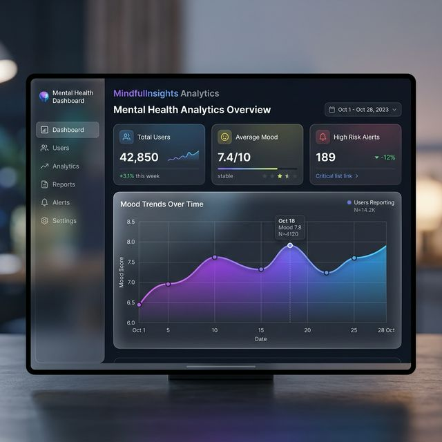
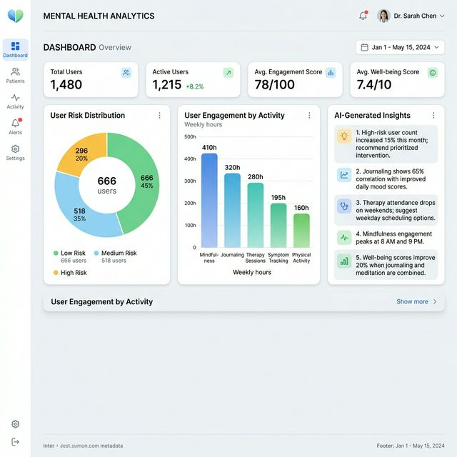
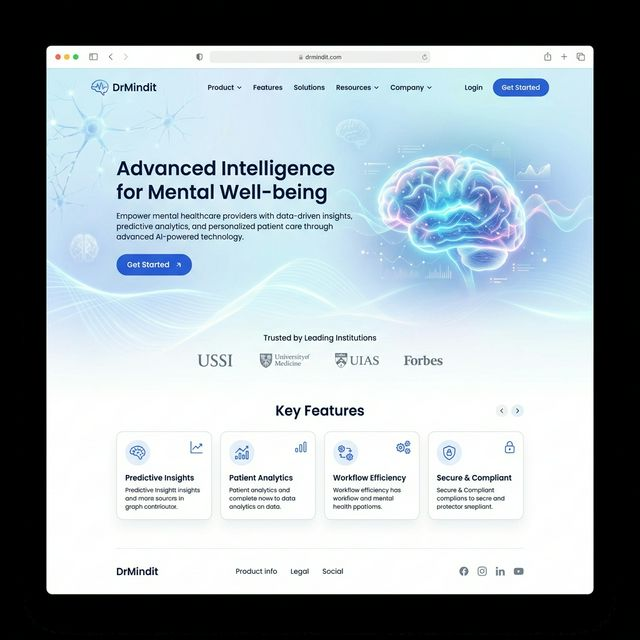

# DrMindit Data Platform 🧠

A professional, production-grade intelligence engine designed for mental health analytics. This platform transforms raw behavioral data into actionable, personalized insights through multi-factor correlation and adaptive baselines.

## 📸 Screenshots

### Executive Dashboard


### Personnel Analytics


### Landing Experience


## 🚀 Features
- **Intelligent Analytics Engine**: Automated trend detection, burnout risk identification, and emotional instability tracking.
- **Personalization Engine**: Rolling 14-day user baselines with adaptive threshold detection.
- **Reliable ETL Pipeline**: Production-ready background scheduler with exponential backoff retries and execution monitoring.
- **Explainable Insights**: Rich API responses providing confidence scores, behavioral reasons, and actionable recommendations.
- **Role-Based Access**: Secure data isolation for individual users and organizational administrators.

## 🏗 Architecture
The platform follows a modular, service-oriented architecture:
- **Ingestion**: Scalable REST layer for high-frequency behavioral event capture.
- **Processing**: Background intelligence pipeline for personalization and metrics aggregation.
- **Serving**: High-performance API layer providing precomputed insights to responsive dashboards.

Detailed documentation: [Architecture Overview](docs/architecture.md)

## ⚙️ Setup Instructions

### Prerequisites
- Node.js (v18+)
- PostgreSQL (Supabase recommended)

### Installation
```bash
# Clone the repository
git clone https://github.com/vishalvs29/Data-platform.git

# Install dependencies
npm install
```

### 🛡️ Production & Security Architecture
DrMindit is built with an enterprise-first approach to security and reliability:

- **Identity Management**: Uses Supabase Auth for high-security JWT-based authentication.
- **API Protection**:
    - **Rate Limiting**: Integrated `express-rate-limit` to prevent brute-force and DoS attacks.
    - **CORS**: Strict CORS policies to ensure only authorized origins can interact with the API.
- **Monitoring & Observability**:
    - **Winston Engine**: Structured JSON logging for all system events and errors.
    - **Health Monitoring**: Detailed `/health` endpoint tracking database connectivity and system uptime.
- **Data Integrity**: Centralized error handling middleware ensures consistent, sanitized error responses across all endpoints.

## ✅ Production Checklist
Before deploying to a production environment:
1. [ ] Set `NODE_ENV=production` in environment variables.
2. [ ] Configure `JWT_SECRET` for secure token signing (if using custom signing).
3. [ ] Set `RATE_LIMIT_MAX` and `RATE_LIMIT_WINDOW` based on expected traffic.
4. [ ] Verify all Supabase RLS (Row Level Security) policies are active.
5. [ ] Ensure Winston is configured to stream logs to a persistent storage service (e.g., CloudWatch, Datadog).

### Environment Setup
Copy the example environment file and fill in your credentials:
```bash
cp .env.example .env
```

### Running the Platform
```bash
# Start the Backend API (Development)
npm run dev:api

# Start the Analytics Dashboard (Development)
npm run dev:dashboard
```

## 📡 API Endpoints
| Category | Endpoint | Method | Description |
| :--- | :--- | :--- | :--- |
| **Ingestion** | `/api/mood` | POST | Log mood scores and clinical notes. |
| **Ingestion** | `/api/session` | POST | Track wellness session completions. |
| **Serving** | `/api/trends` | GET | Retrieve personalized behavioral trends. |
| **Serving** | `/api/insights` | GET | Fetch rich, explainable AI insights. |
| **Admin** | `/api/admin/overview` | GET | Organizational high-level analytics. |

Detailed reference: [API Documentation](docs/api.md)

## 🧪 Testing
The platform uses Jest for unit and integration testing.
```bash
# Run all tests
npm test
```

## 🔐 Security
- **Data Isolation**: Row Level Security (RLS) ensures users only access their own data.
- **Authentication**: Key-based authentication for ingestion and administrative isolation for organization-wide metrics.
- **Configuration**: All secrets are managed via environment variables; never committed to source control.
