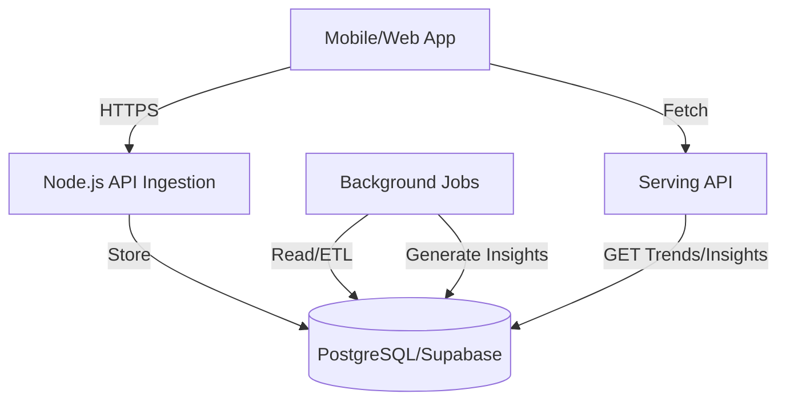

# DrMindit Data Platform

A production-ready mental health analytics platform supporting real-time data ingestion, automated ETL processing, and insight generation.

## 🏗 Architecture Overview

### Key Components

1.  **Ingestion Layer**: REST APIs for mood logs, user sessions, and custom events.
2.  **Storage Layer**: PostgreSQL schema optimized for time-series mental health data.
3.  **Analytics Engine**: Background jobs detecting low mood streaks, stress spikes, and engagement warnings.
4.  **Serving Layer**: High-performance endpoints for aggregated trends and personalized insights.

## 🚀 Getting Started

### Prerequisites
- Node.js v18+
- Supabase Project (PostgreSQL)

### Backend Setup
1. `cd backend`
2. `npm install`
3. `cp .env.example .env` (Fill in your Supabase credentials and API keys)
4. `npm run build`
5. `npm start` (or `npm run dev` for development)

### Database Setup
Apply the latest `schema.sql` found in the root directory to your Supabase SQL Editor. This initializes all tables, RLS policies, indexes, and RPC functions.

## 🧠 Advanced Intelligence Engine
The platform features a multi-factor intelligence layer that provides personalized, explainable insights:

- **Personalization**: Computes user-specific baselines (14-day rolling averages) to detect meaningful deviations rather than using fixed thresholds.
- **Multi-Factor Analysis**: Correlates mood fluctuations with session completion, app engagement, and behavioral patterns (e.g., Burnout Detection).
- **Rich Insights**: Every insight includes:
    - **Confidence Score**: Probability of the insight's accuracy (0.0 - 1.0).
    - **Reasons**: A structured list of contributing factors for full explainability.
    - **Recommendations**: Personalized, actionable next steps.
- **Production-Grade Reliability**: Backend jobs run with a dedicated `JobRunner` featuring:
    - **Exponential Backoff**: Automatic retries for failed analytics tasks.
    - **Execution Tracking**: Detailed logs in `job_logs` for monitoring and debugging.

### Intelligent Serving Layer
High-performance endpoints providing precomputed insights and trends.

| Endpoint | Method | Description |
| :--- | :--- | :--- |
| `/api/mood` | POST | Log user mood (1-10) and notes. |
| `/api/session` | POST | Track completed meditation/breathing sessions. |
| `/api/trends` | GET | Returns personalized daily/weekly trends and mood direction. |
| `/api/risk` | GET | Returns explainable risk level (Low/Med/High) with reasons. |
| `/api/insights`| GET | Retrieve rich AI-generated insights & recommendations. |

## 🧠 Intelligence Engine
The platform automatically detects patterns using a sophisticated rules engine:
- **Low Mood Streak**: 3+ days with mood < 3.
- **Emotional Instability**: High standard deviation in mood scores.
- **Mood Direction**: Comparative weekly analysis (Improving/Declining/Stable).
- **Drop-off Detection**: Automated pings after 3 days of inactivity.

> [!IMPORTANT]
> All requests must include the `x-api-key` header for authentication.

## 🛡 Security & Privacy
- **Row Level Security (RLS)**: Enforced at the database level.
- **Audit Logging**: All sensitive mutations are captured.
- **Zod Validation**: Prevents malformed data ingestion.
For a full list of dependencies, see [package.json](./package.json).

## Development Tools

- TypeScript: ~5.8.3
- ESLint: ^9.25.0
- @babel/core: ^7.25.2

## Contributing

1. Fork this repository
2. Create a new branch (`git checkout -b main`)
3. Commit your changes (`git commit -am 'Add new feature'`)
4. Push to the branch (`git push origin feature/your-feature`)
5. Open a Pull Request

## License

This project is private ("private": true). For collaboration inquiries, please contact the author.

---

Feel free to add project screenshots, API documentation, feature descriptions, or any other information as needed.
