# Architecture Overview - DrMindit Data Platform

The DrMindit Data Platform is a production-grade intelligence engine designed for mental health analytics, featuring multi-factor correlation and personalized behavioral insights.

## 🏗 System Components

```mermaid
graph TD
    A[Mobile Clients] -->|Ingestion API| B(Node.js REST Layer)
    B -->|Logs| C[(PostgreSQL / Supabase)]
    D[Background Scheduler] -->|Triggers| E{Job Runner}
    E -->|Personalization| F[Intelligence Engine]
    E -->|Aggregation| G[Analytics Service]
    F & G -->|Precomputed Insights| C
    H[Admin/User Dashboard] -->|Serving API| B
    B -->|Reads| C
```

### 1. Ingestion Layer
Captures high-frequency events from client applications, including mood logs, meditation sessions, and arbitrary interaction events. Built with **Express** and **Zod** for strict schema validation.

### 2. Intelligent Processing Pipeline
A multi-stage background pipeline that runs daily to transform raw logs into actionable insights:
- **Analytics Engine**: Precomputes daily and weekly aggregates (mood averages, engagement scores, trend directions).
- **Intelligence Engine**: Performs multi-factor analysis (e.g., mood/session correlation, burnout detection) and updates personalized user baselines.

### 3. Personalization Engine
Uses a rolling 14-day window to establish a "normal" baseline for each user. Insights are generated based on deviations from this personal baseline rather than static global thresholds.

### 4. Background Job Management
A robust `JobRunner` service ensures reliability through:
- **Exponential Backoff**: Automatic retries for intermittent failures.
- **Observability**: Execution logs stored in `job_logs` with timing and error traces.

### 5. Serving API
A high-performance REST layer that provides precomputed data to frontend dashboards, ensuring instant load times (no heavy computation on-request).
